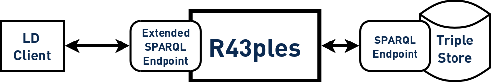

# R43ples

R43ples (Revision for triples) is an open source Revision Management Tool for the Semantic Web.

It provides different revisions of named graphs via a SPARQL interface. All information about revisions, changes, commits, branches and tags are stored in additional named graphs beside the original graph in an attached external triple store.

[](https://travis-ci.org/plt-tud/r43ples)
[](https://scan.coverity.com/projects/2125)
[](https://codecov.io/gh/plt-tud/r43ples)
[](https://codebeat.co/projects/github-com-plt-tud-r43ples-develop)
[](https://www.ohloh.net/p/r43ples)


This project provides an enhanced SPARQL endpoint for revision management of named graphs.
R43ples uses an internal Jena TDB is attached to an existing SPARQL endpoint of a triplestore and acts as another endpoint both for normal SPARQL queries
as well as for revision-enhanced SPARQL queries, named R43ples queries.
The R43ples endpoint allows to specify revisions which should be queried for each named graph used inside a SPARQL query.
The whole revision information is stored in additional graphs in the attached Jena TDB.

The [website](http://plt-tud.github.io/r43ples) of R43ples contains further [project information](http://plt-tud.github.io/r43ples/site/project-reports.html) including [Javadocs](http://plt-tud.github.io/r43ples/site/apidocs/) of the *develop* branch.
A running test server should be available under [http://eatld.et.tu-dresden.de:9998/r43ples/sparql](http://eatld.et.tu-dresden.de:9998/r43ples/sparql)


## Getting Started
### Dependencies
* JDK 1.7
* Maven

	sudo apt-get install maven default-jdk


### Compiling
Maven is used for compiling

    mvn compile exec:java

Packages (JAR with dependencies for the webservice, a console client and a debian package) can be be built with:

    mvn package

### Running

R43ples runs with standalone web server

``` bash
java -jar r43ples-*-with-dependencies.jar
```

### Releases

Releases are stored on [GitHub](https://github.com/plt-tud/r43ples/releases).

There are also debian packages available.


## Configuration

There is a configuration file named *resources/r43ples.conf*. The most important ones are the following:

* *triplestore.type* - type of attached triplestore (can be tdb, virtuoso [not working right now], http)
* *triplestore.uri* - URI or path under which R43ples can access the attached triplestore
* *triplestore.user* - user of attached triplestore if necessary
* *triplestore.password* - password of attached triplestore if necessary
* *revision.graph* - named graph which is used by R43ples to store revision graph information
* *sdd.graph* - named graph for storing the SDD
* *service.host* - host which provides R43ples
* *service.port* - port which should provide R43ples
* *service.path* - path of host which should provide R43ples

The logging configuration is stored in *resources/log4j.properties*


## Interfaces

### Extended SPARQL endpoint
SPARQL endpoint is available at:

    [uri]:[port]/r43ples/sparql

The endpoint directly accepts SPARQL queries with HTTP GET or HTTP POST parameters for *query* and *format*:

    [uri]:[port]/r43ples/sparql?query=[]&format=[]

#### Supported Formats

The formats can be specified as URL Path Parameter *format*, as HTTP post paramter *format* or as HTTP header parameter *Accept*:

* text/turtle
* application/json
* application/rdf+xml
* text/html
* text/plain


#### R43ples keywords

There are some additional keywords which extends SPARQL and can be used to control the revisions of graphs:

* Create graph

        CREATE GRAPH <graph>

* Select query

        SELECT *
        WHERE {
        	GRAPH <graph> REVISION "23" {?s ?p ?o}
    	}

* Update query

        USER "mgraube" MESSAGE "test commit"
        INSERT {
            GRAPH <test> REVISION "2" {
                <a> <b> <c> .
            }
        }

* Branching

        USER "mgraube"
        MESSAGE "test commit"
        BRANCH GRAPH <test> REVISION "2" TO "unstable"

* Tagging

        USER "mgraube"
        MESSAGE "test commit"
        TAG GRAPH <test> REVISION "2" TO "v0.3-alpha"

* Merging

		USER "mgraube"
		MESSAGE "merge example"
		MERGE GRAPH <test> BRANCH "branch-1" INTO "branch-2"
		
* Pick a revision into a branch
        
        USER "Mister X."
        MESSAGE "pick single revision example"
        PICK GRAPH <test> REVISION "56" INTO BRANCH "develop"
        
        USER "Mister X."
        MESSAGE "pick multiple revisions example"
        PICK GRAPH <test> REVISION "56" TO REVISION "62" INTO BRANCH "develop"


#### Query Rewriting option

There is a new option for R43ples which improves the performance. The necessary revision is not temporarily generated anymore.
The SPARQL query is rewritten in such a way that the branch and the change sets are directly joined inside the query. This includes the order of the change sets.
It is currently under development and further research.

The option can be enabled by passing an additional parameter "query_rewriting=true"

It currently supports:

* Multiple Graphs
* Multiple TriplePath
* FILTER
* MINUS

For more details, have a look into the *doc/* directory.

### Debug SPARQL endpoint

R43ples redirects the queries performed on the debug endpoint directly to the attached triplstore.
Thus, this endpoint can be used for debugging purposes.

	[uri]:[port]/r43ples/debug

### API
R43ples provides some functionalities additionally via an external API, even if all information can also be queried directly from the triplestore

* *api/getRevisedGraphs* lists all graphs managed by R43ples
* *createSampleDataset* generates some sample datasets with revision information
* *revisiongraph?graph=<test>&format=application/json* provides the revision graph for the specified graph (

## Concept of R43ples

### Extended SPARQL proxy

R43ples itself does not story any information. All information in the revised graphs and about the revised graphs
are stored in the attached triplestore. R43ples acts only as a proxy which evaluates additional revision information
in the SPARQL queries.




### Revision information

All information about the revision history of all named graphs is stored in the named graph **http://eatld.et.tu-dresden.de/r43ples-revisions** (as long as not configured otherwise in the configuration file).

Here, the Revision Management Ontology (RMO) is used to model revisions, branches and tags. Furthermore commits are stored which connect each revision, tag and branch with its prior revision.

The RMO is derived from the PROV ontology:


An exemplary revision graph is shown here:


### HTTP Header information

Each response header contains information about the revision information of the graphs specified in the requests in the *r43ples-revisiongraph* HTTP header field. This information follows the RMO and is transferred as Turtle serialization.

Clients can also pass this information in R43ples update queries to the R43ples server via the *r43ples-revisiongraph* HTTP header attribute.
The server will check if the client is aware of the most recent version of the involved revised graphs. If this is not the case,
the update query will be rejected.


## Used libraries and frameworks

Following libraries are used in R43ples:

* [Jersey](https://jersey.java.net/) for RestFul web services in Java
* [Grizzly](https://grizzly.java.net/) as web server
* [Jena ARQ](https://jena.apache.org/documentation/query/index.html) for processing SPARQL results
* [Jena TDB](https://jena.apache.org/documentation/tdb/index.html) as triplestore
* [jQuery](http://jquery.com/) as JavaScript framework
* [Bootstrap](http://getbootstrap.com/) as HTML, CSS and JS framework
* [Mustache](https://mustache.github.io/) as template engine

 
